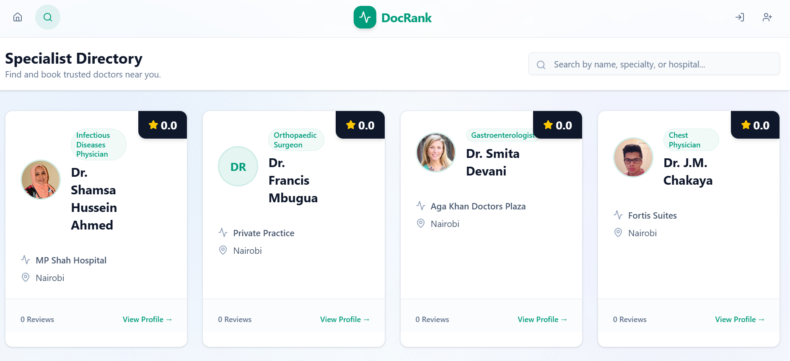
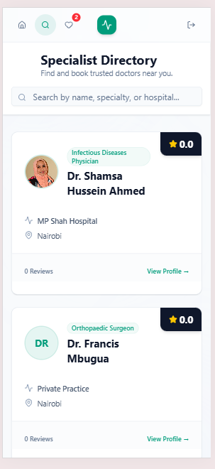
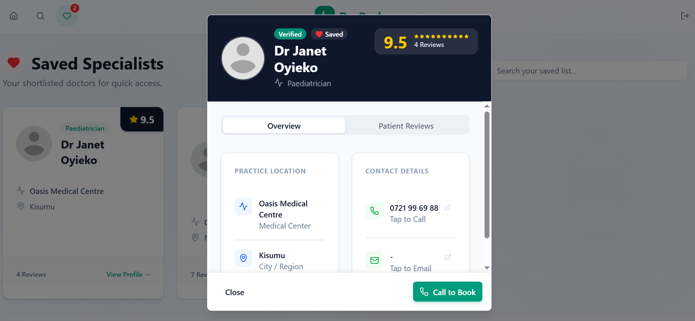
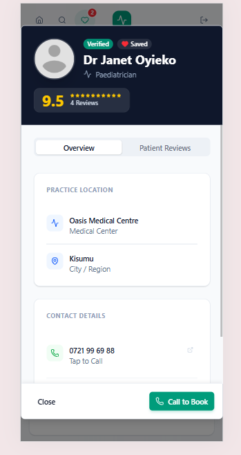
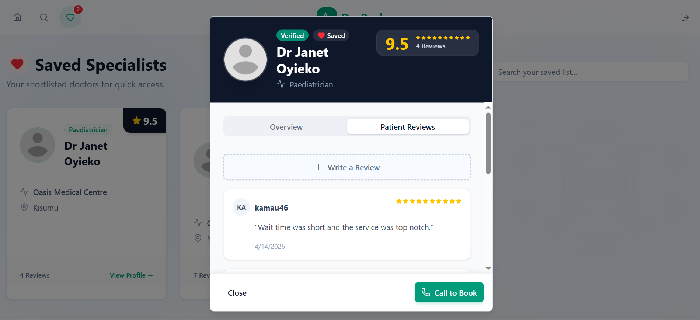
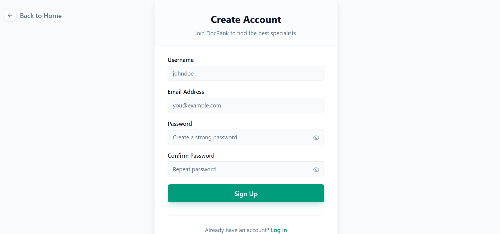
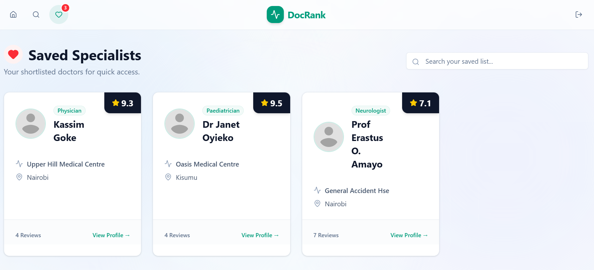

# 🩺 DocRank — Frontend

> React + TypeScript SPA for discovering, reviewing, and saving doctors. Built with Vite, TailwindCSS, and shadcn/ui. Connects to a Django REST Framework backend via JWT-authenticated Axios calls.

[](https://react.dev/)
[](https://www.typescriptlang.org/)
[](https://vitejs.dev/)
[](https://tailwindcss.com/)
[](LICENSE)

---

## 📸 App Preview

> Screenshots from the live app at [docrank.jbnmedia.org](https://docrank.jbnmedia.org)  
> Each view shown in both **desktop** and **mobile**.

---

### 🗂️ Doctor Listing

| Desktop | Mobile |
|:---:|:---:|
|  |  |

---

### 🩺 Doctor Detail — Profile & Info

| Desktop | Mobile |
|:---:|:---:|
|  |  |

---

### ⭐ Doctor Detail — Reviews Section

| Desktop | Mobile |
|:---:|:---:|
|  |  |

---

### 🔐 Register Page

| Desktop | Mobile |
|:---:|:---:|
|  |  |

---

### 🔖 Saved Doctors

| Desktop | Mobile |
|:---:|:---:|
|  |  |

---

## 🌐 Overview

DocRank Frontend is the client-side interface for the DocRank platform — a doctor discovery and review system for the Kenyan healthcare market. Users can:

- 🏠 **Land on a hero page** with top-rated doctors surfaced immediately — no login required
- 🔍 **Search in real time** across name, specialty, hospital, and location with 300ms debounce
- 🩺 **Open a full doctor profile** in a modal — contact info, tabbed reviews, and a rating form
- ⭐ **Submit, edit, or delete reviews** with a 1–10 star rating (authenticated users only)
- 🔖 **Save and unsave doctors** with optimistic UI updates and a live badge count in the navbar
- 🔐 **Register with OTP email verification** and log in with username or email
- 🔑 **Reset passwords** via an OTP-to-email flow

---

## ✨ Tech Stack

| Layer | Technology |
|---|---|
| Framework | React 19 + TypeScript 5.9 |
| Build Tool | Vite 7 |
| Styling | TailwindCSS 4 |
| UI Components | shadcn/ui + Radix UI |
| Routing | React Router DOM v7 |
| HTTP Client | Axios (JWT Bearer interceptor) |
| Icons | Lucide React |
| Linting | ESLint 9 + TypeScript ESLint |

---

## 📁 Project Structure

```
src/
├── api/
│   └── axios.ts              # Axios instance — base URL + auto JWT header injection
├── components/
│   ├── DoctorCard.tsx         # Doctor listing card with save toggle
│   ├── DoctorDetails.tsx      # Full doctor modal — profile, tabs, reviews, rating form
│   ├── Layout.tsx             # Persistent layout wrapper with Navbar
│   ├── Navbar.tsx             # Fixed top nav — auth-aware, saved badge count, logout dialog
│   └── ui/                   # shadcn/ui primitives
│       ├── alert.tsx
│       ├── avatar.tsx
│       ├── badge.tsx
│       ├── button.tsx
│       ├── card.tsx
│       ├── dialog.tsx
│       ├── dropdown-menu.tsx
│       ├── input.tsx
│       ├── label.tsx
│       ├── progress.tsx
│       ├── scroll-area.tsx
│       ├── select.tsx
│       ├── separator.tsx
│       ├── tabs.tsx
│       ├── textarea.tsx
│       └── tooltip.tsx
├── context/
│   ├── AuthContext.tsx        # JWT state — login, logout, token persistence (localStorage)
│   └── SavedContext.tsx       # Saved doctors IDs — optimistic toggle, badge sync
├── pages/
│   ├── Home.tsx              # Hero + features section + top 6 rated doctors grid
│   ├── Doctors.tsx           # Full directory — live search with 300ms debounce
│   ├── SavedDoctors.tsx      # User's bookmarked doctors (protected)
│   ├── MyReviews.tsx         # User's submitted reviews (protected)
│   ├── Login.tsx             # Login with username or email
│   ├── Register.tsx          # Registration + OTP email verification step
│   ├── ForgotPassword.tsx    # Request password reset OTP
│   └── ResetPassword.tsx     # Confirm OTP + set new password
├── lib/
│   └── utils.ts              # cn() utility (clsx + tailwind-merge)
├── App.tsx                   # Route definitions + ProtectedRoute wrapper
└── main.tsx                  # App entry point
```

---

## 🗺️ Routes

| Route | Access | Page | Description |
|---|---|---|---|
| `/` | Public | `Home.tsx` | Hero, feature cards, top 6 doctors |
| `/doctors` | Public | `Doctors.tsx` | Full directory with live search |
| `/saved` | 🔒 Protected | `SavedDoctors.tsx` | Bookmarked doctors list |
| `/my-reviews` | 🔒 Protected | `MyReviews.tsx` | User's submitted reviews |
| `/login` | Public | `Login.tsx` | Login with username or email |
| `/register` | Public | `Register.tsx` | Register + OTP verification |
| `/forgot-password` | Public | `ForgotPassword.tsx` | Request password reset OTP |
| `/reset-password` | Public | `ResetPassword.tsx` | Confirm OTP + new password |

> Protected routes redirect to `/login` if the user is not authenticated.

---

## 🔐 Auth Flow

```
Register  → OTP emailed → Verify OTP → JWT issued → Logged in
Login     → JWT access + refresh tokens → stored in localStorage
Forgot    → OTP emailed → Confirm OTP + new password → redirect to login
```

JWT tokens are stored in `localStorage` and automatically attached to every Axios request via a request interceptor. On app load, `AuthContext` checks `localStorage` to restore the session without requiring a re-login.

---

## 💾 Saved Doctors — Optimistic UI

The `SavedContext` uses **optimistic updates** — the heart icon toggles instantly in the UI before the API call completes. If the API call fails, the state is reverted. The navbar heart icon shows a live badge count of saved doctors.

---

## ⚙️ Setup & Installation

### Prerequisites

- Node.js 18+
- npm
- Backend API running (see [DOCTOR_SEARCH_BACKEND](https://github.com/JessyWaweru/DOCTOR_SEARCH_BACKEND))

### Installation

```bash
# Clone the repo
git clone https://github.com/JessyWaweru/DOCTOR_SEARCH_FRONTEND.git
cd DOCTOR_SEARCH_FRONTEND

# Install dependencies
npm install

# Start development server
npm run dev
```

App runs at `http://localhost:5173` by default.

---

## 🌍 Environment Variables

Create a `.env` file in the project root:

```env
VITE_API_URL=http://localhost:8000/api
```

In production, set `VITE_API_URL` to your deployed Render backend URL. This is injected at build time by Vite — the Axios instance falls back to `http://localhost:8000/api` if the variable is not set.

---

## 📜 Scripts

| Command | Description |
|---|---|
| `npm run dev` | Start Vite dev server with HMR |
| `npm run build` | Type-check + production build |
| `npm run preview` | Preview production build locally |
| `npm run lint` | Run ESLint |

---

## 👤 Author

**Jessy Waweru**
[github.com/JessyWaweru](https://github.com/JessyWaweru)

---

## 🔗 Links

| | |
|---|---|
| 🔧 Backend repo | [DOCTOR_SEARCH_BACKEND](https://github.com/JessyWaweru/DOCTOR_SEARCH_BACKEND) |
| 🖥️ Frontend repo | [DOCTOR_SEARCH_FRONTEND](https://github.com/JessyWaweru/DOCTOR_SEARCH_FRONTEND) |
| 🌍 Live app | [docrank.jbnmedia.org](https://docrank.jbnmedia.org) |